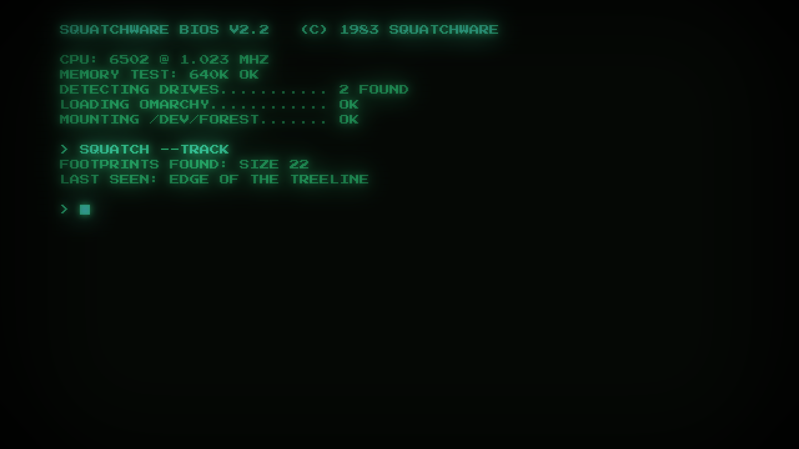
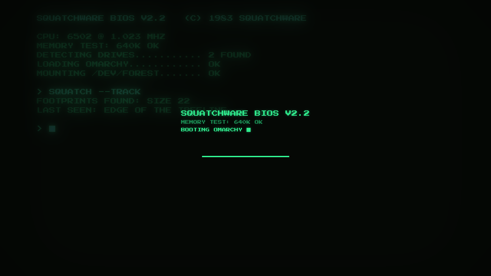

# Phosphor Green for Omarchy

A P1 green monochrome monitor: glow, scanlines and a boot screen that takes its time.

Part of the [Squatchware Retro Pack](https://squatchware.dev/retro/): six Omarchy themes for the
machines that raised us, each with a squatch hiding somewhere in it.




## Install

```sh
omarchy theme install https://github.com/squatchware/omarchy-phosphor-green-theme
```

## What's in it

- **Colours** for everything Omarchy themes (terminals, Hyprland, the shell, btop, editors…),
  generated by Omarchy from `colors.toml`. Every text colour clears 4.5:1 on its background.
- **Wallpapers**, drawn at the machine's own resolution and scaled up with no smoothing:
- `01-boot.jpg`
- `02-treeline.jpg`
- **Boot splash and lock screen** (`unlock.png`): the machine's own start-up screen.
- **Screensaver** art (`screensaver.txt`), animated by Omarchy's screensaver.

## Extras

The screensaver and boot splash need one command each (the second asks for sudo):

```sh
~/.config/omarchy/themes/phosphor-green/extras/install-extras.sh          # screensaver
~/.config/omarchy/themes/phosphor-green/extras/install-extras.sh --boot   # + boot splash
```

The screensaver hook is shared by every Squatchware theme: it uses the active theme's art and
puts your own back when you switch to a theme without any. The boot splash stays until you run
`omarchy plymouth set by theme <name>` for another theme.

## The rest of the pack

- [Commodore 64](https://github.com/squatchware/omarchy-c64-theme): READY. Light blue on blue, the 16-colour VIC-II palette, and a squatch on tape.
- [Apple II](https://github.com/squatchware/omarchy-apple-2-theme): Green phosphor text over lo-res colour: the ] prompt and sixteen blocky colours.
- [Teletext](https://github.com/squatchware/omarchy-teletext-theme): Page 100. Eight colours, chunky mosaic graphics and double-height headlines.
- [Nixie](https://github.com/squatchware/omarchy-nixie-theme): Neon-orange cathodes behind glass, brass and bronze fittings, warm smoky black.
- [Phosphor Amber](https://github.com/squatchware/omarchy-phosphor-amber-theme): A P3 amber monochrome monitor: the warm one, easy on the eyes after midnight.

## Credits

Built by `src/build.py` in the Retro Pack builder; change things there, not here. Press Start 2P
is by CodeMan38 and IBM Plex by IBM, both under the SIL Open Font License. Commodore 64, Apple II
and Teletext are trademarks or names of their owners; this is a fan tribute with no connection
to any of them.

The theme files are MIT (see [LICENSE](LICENSE)). The squatch character and the other
Squatchware artwork are not covered by that licence and aren't for reuse.

From [Squatchware](https://squatchware.dev) · Pixel-powered apps, tools & themes. Handmade in the woods.
